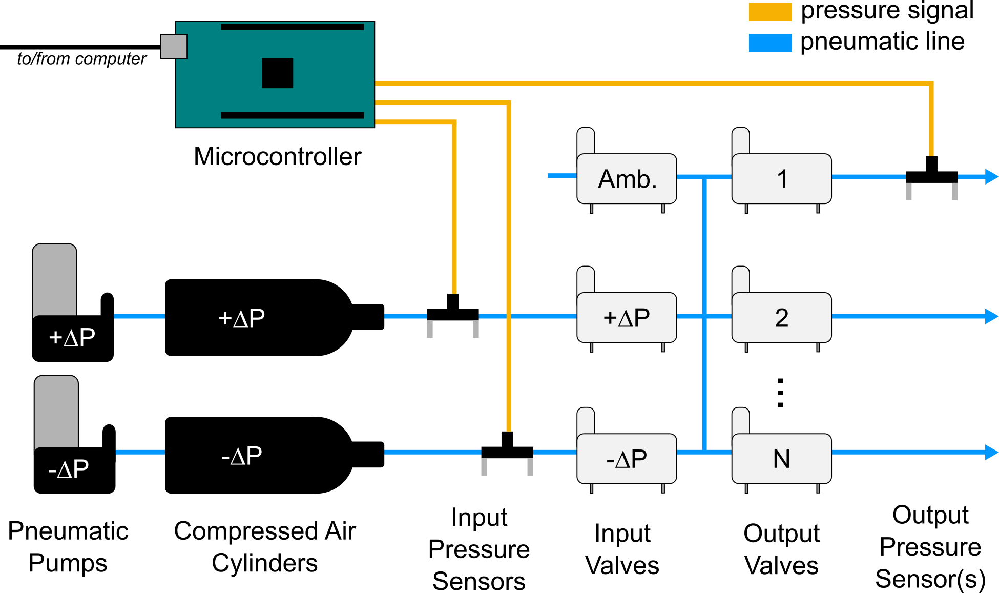
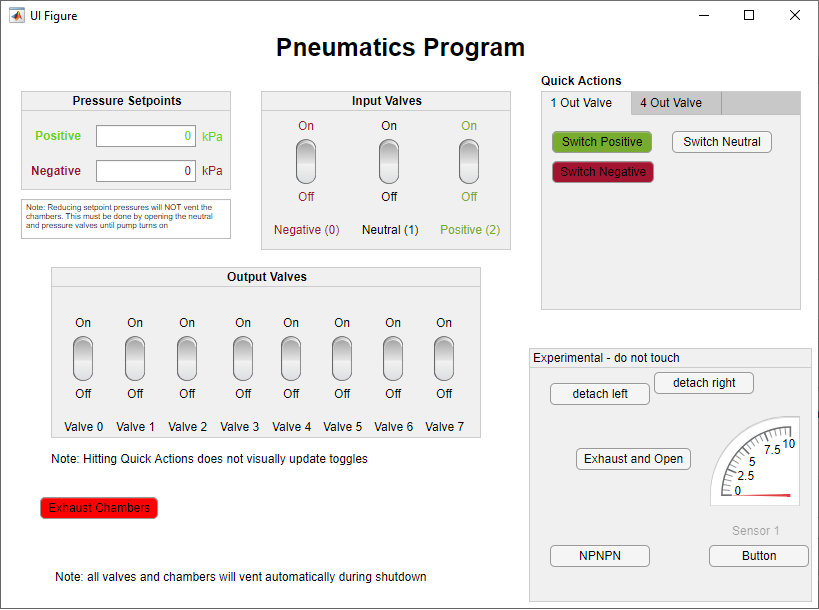

# Pneumatics
Herein is described the pneumatic control system used in the HATTONLAB to control pneumatic smart surfaces.

# Overview
This system is designed to control multi-channel pneumatic smart surfaces using only small amounts of air. The pneumatic system consists of 8 independent pneumatic channels that can access positive, negative, and neutral (exhaust) states. 

# Pneumatic Logic

The Pneumatic logic is as follows:

Two pumps (one for positive and one for negative pressure) pressurize two resevoirs. 

Valves
on the inlet side, there are three valves that control inlet flow.
1 to allow positive pressure
1 to allow negative pressure
1 to exhuast

On the outlet side, valves can be turned on to pressurize the channels.There are currently 8 output valves.

# Control

The Arduino microncontroller is responsible for opening and closing the pneumatic valves in addition to regulating pressure setpoints of the reservoirs. 

Setpoint control is currently only simple state monitoring. The pumps will turn on if the reservoirs are underpressurized below a threshold. For example, if the setpoint is +5kPa, the pump will turn on if < 4.7kPa... (a 0.3kPa threshold).

Communication to the microcontroller is accomplished through serial communication. Commands for valve control, setpoint, and pressure value requests are available in the X section.

A MATLAB GUI app uses these commands to visually control the pneumatics.

screenshot to be added later.

# Serial Command List

## How to send a command through serial

The Arduino is listening for serial commands in the following structure ‘< command, optional modifier, optional modifier>’.

## Command List

### Valve Control

| Command Syntax | Description                                                  | Example                                 |
| :------------: | ------------------------------------------------------------ | --------------------------------------- |
|     **VO**     | **VALVE OUTPUT** Changes the state of a single output valve. <command, valve # (0-7), valve state (0-closed 1-open)> | <VO, 4, 1> opens the fifth output valve |
|     **VI**     | **VALVE INPUT**Changes the state of a single input valve. <command, valve # (0-7), valve state (0-off 1-on)> | <VO, 4, 1> opens the fifth output valve |
|    **AIV**     | **ALL INPUT VALVES** Changes the state of all input valves <command, 0/1> | <AIV,1> opens all input valves          |
|    **AOV**     | **ALL OUTPUT VALVES** Changes the state of all outpu valves <command, 0/1> | <AOV, 0> turns off all output valves    |

### Reservoir Setpoints

| Command Syntax | Description                                                  | Example    |
| :------------: | ------------------------------------------------------------ | ---------- |
|    **PSP**     | Changes setpoint of positive pressure reservoir              | <PSP, 15>  |
|    **NSP**     | Changes setpoint of negative pressure reservoir              | <NSP, -15> |
|    **PVN**     | **PRESSURE VALUE NEGATIVE** prints the pressure value of the negative pressure reservoir | <PVN>      |
|    **PVO**     | **PRESSURE VALUE OUTPUT** prints the pressure value of an output pressure channel | <PVO, 3>   |
|    **PVP**     | **PRESSURE VALUE POSITIVE** prints the pressure value of the positive pressure reservoir | <PVP>      |

### Pressure Readings

| Command Syntax | Description                                                  | Example  |
| :------------: | ------------------------------------------------------------ | :------: |
|      PVP       | **PRESSURE VALUE POSITIVE** prints the pressure value of the positive pressure reservoir |  <PVP>   |
|      PVN       | **PRESSURE VALUE NEGATIVE** prints the pressure value of the negative pressure reservoir |  <PVN>   |
|      PVO       | **PRESSURE VALUE OUTPUT** prints the pressure value of an output pressure channel | <PVO, 3> |

## Visual Control App

A visual control app was designed using Matlab App Designer. The app is basic in functionality but is able to control valves through sending serial commands. 

